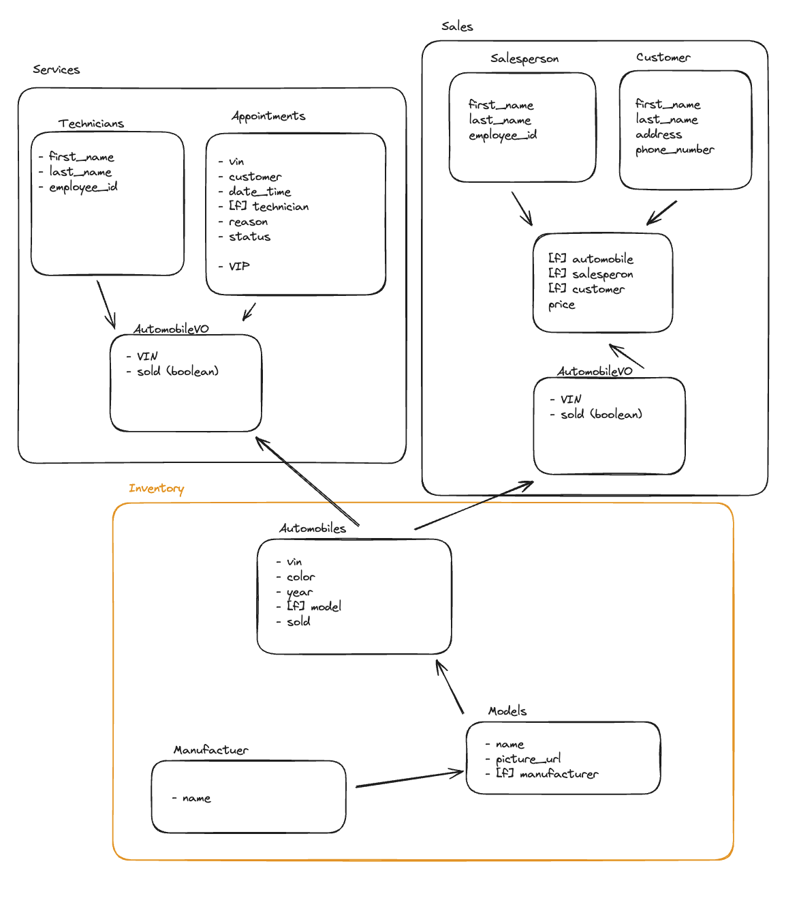

# CarCar
CarCar is an app for managing everything in an auto dealership - from cars to sales, and from salespeople to technicians and services.

## Team
- **Henry Martija** - Auto Sales.
- **Christian Ramos** - Auto Services.

## Setup Instructions
1. **Install Dependencies**
   - Ensure Docker, Git, and Node.js are installed on your system.

2. **Clone the Repository**
   - Clone the CarCar project from GitLab:
     ```
     git clone https://gitlab.com/hencray/project-beta
     ```

3. **Project Setup**
   - Navigate to the project directory and run:
     ```
     docker-compose build
     docker-compose up
     ```
   - This will set up all necessary containers and services.

4. **Accessing the Application**
   - Once the setup is complete, access the application via:
     `http://localhost:3000/` in your web browser.

## Design
### Microservices Overview


### Inventory Microservice (Port: 8100)
The Inventory Microservice is dedicated to managing your dealership's vehicle inventory. It allows for detailed viewing of inventory, individual vehicle models, and specific automobile details.

#### Key Components
- **Manufacturers**: This covers all the vehicle manufacturers in your inventory.
- **Vehicle Models**: Details about different models of vehicles available.
- **Automobiles**: Individual vehicles in your inventory, each with unique attributes.

#### Core Features
- **Inventory Management**: Tracking and management of all vehicles in your dealership’s inventory.

#### API Endpoints

| Endpoint                           | Method | URL                                            |
|------------------------------------|--------|------------------------------------------------|
| Manufacturers List                 | GET    | `GET http://localhost:8100/api/manufacturers/` |
| Manufacturers Create               | POST   | `POST http://localhost:8100/api/manufacturers/`|
| Manufacturers Get Specific         | GET    | `GET http://localhost:8100/api/manufacturers/:id/`|
| Manufacturers Update               | PUT    | `PUT http://localhost:8100/api/manufacturers/:id/`|
| Manufacturers Delete               | DELETE | `DELETE http://localhost:8100/api/manufacturers/:id/`|

| Endpoint                           | Method | URL                                    |
|------------------------------------|--------|----------------------------------------|
| Vehicle Models List                | GET    | `GET http://localhost:8100/api/models/` |
| Vehicle Models Create              | POST   | `POST http://localhost:8100/api/models/`|
| Vehicle Models Get Specific        | GET    | `GET http://localhost:8100/api/models/:id/`|
| Vehicle Models Update              | PUT    | `PUT http://localhost:8100/api/models/:id/`|
| Vehicle Models Delete              | DELETE | `DELETE http://localhost:8100/api/models/:id/`|

| Endpoint                           | Method | URL                                        |
|------------------------------------|--------|--------------------------------------------|
| Automobiles List                   | GET    | `GET http://localhost:8100/api/automobiles/` |
| Automobiles Create                 | POST   | `POST http://localhost:8100/api/automobiles/`|
| Automobiles Get Specific           | GET    | `GET http://localhost:8100/api/automobiles/:vin/`|
| Automobiles Update                 | PUT    | `PUT http://localhost:8100/api/automobiles/:vin/`|
| Automobiles Delete                 | DELETE | `DELETE http://localhost:8100/api/automobiles/:vin/`|


#### Example Data Entries

1. **Creating a Manufacturer**
   ```js
   POST /api/manufacturers/
    {
      "name": "Brady Motors",
      "headquarters": "Tampa, FL",
      "founded_year": "2023"
    }
   ```

2. **Adding a Vehicle Model**
   ```js
    POST /api/models/
    {
      "manufacturer_id": "1",  // Assuming this is the ID of Brady Motors
      "model_name": "Gronkowski GT",
      "type": "SUV",
      "launch_year": "2023"
    }
   ```

3. **Adding an Automobile**
   ```js
   POST /api/sales/
    POST /api/automobiles/
    {
      "vin": "VIN123456789012345",
      "model_id": "101",  // Assuming this is the ID of Gronkowski GT model
      "color": "Patriot Blue",
      "price": "55000"
    }
   ```


### Service Microservice
  - The Service microservice manages service appointments, including their creation, cancellation, and completion.
  - Utilizes models like `Technician`, `AutomobileVO`, and `Appointment` for managing service-related data.
  - Special features include marking appointments as "VIP" based on VIN match in inventory and maintaining service history.
  - Error handling includes returning 400 or 404 errors for unsuccessful requests or non-existent model objects.
  
- **API Endpoints:**
  - **Technicians**
    - List: `GET http://localhost:8080/api/technicians/`
    - Create: `POST http://localhost:8080/api/technicians/`
    - Delete Specific: `DELETE http://localhost:8080/api/technicians/:id/`
  - **Appointments**
    - List: `GET http://localhost:8080/api/appointments/`
    - Create: `POST http://localhost:8080/api/appointments/`
    - Delete: `DELETE http://localhost:8080/api/appointments/:id/`
    - Set Status to "Canceled": `PUT http://localhost:8080/api/appointments/:id/cancel/`
    - Set Status to "Finished": `PUT http://localhost:8080/api/appointments/:id/finish/`

### Sales Microservice (Port: 8090)
The Sales Microservice manages automobile sales to customers and  ensures that the dealership only sells vehicles that are not already sold, thereby maintaining inventory accuracy.

#### Key Components
- **Salesperson**: Each salesperson in the dealership is recorded with `first_name`, `last_name`, and a unique `employee_id`.
- **Customer**: This model captures details of the buyers, including their `first_name`, `last_name`, `phone_number`, and `address`.
- **Sale**: This record links a salesperson and a customer to a vehicle, detailing the sale transaction, including the price.
- **AutomobileVO (Value Object)**: This model is focused on vehicle details, uniquely identified by a `vin`. Notably, the Automobile is treated as a value object in our system, defined by its attributes.

#### Core Features
- **Unsold Only Policy**: This feature ensures that sales are only processed for vehicles that are currently unsold, ensuring reliability in inventory management.

#### API Endpoints
#### Salespeople

| Action          | Method | Endpoint                                |
|-----------------|--------|-----------------------------------------|
| List            | GET    | `GET http://localhost:8090/api/salespeople/` |
| Create          | POST   | `POST http://localhost:8090/api/salespeople/` |
| Delete          | DELETE | `DELETE http://localhost:8090/api/salespeople/:id/` |


#### Customers

| Action          | Method | Endpoint                                |
|-----------------|--------|-----------------------------------------|
| List            | GET    | `GET http://localhost:8090/api/customers/` |
| Create          | POST   | `POST http://localhost:8090/api/customers/` |
| Delete          | DELETE | `DELETE http://localhost:8090/api/customers/:id/` |

#### Sales

| Action          | Method | Endpoint                                |
|-----------------|--------|-----------------------------------------|
| List            | GET    | `GET http://localhost:8090/api/sales/` |
| Create          | POST   | `POST http://localhost:8090/api/sales/` |
| Delete          | DELETE | `DELETE http://localhost:8090/api/sales/:id/` |


#### Example Data Entries

1. **Creating a Salesperson**
   ```js
   POST /api/salespeople/
   {
     "first_name": "LeBron",
     "last_name": "James",
     "employee_id": "LBJ23"
   }
   ```

2. **Adding a Customer**
   ```js
   POST /api/customers/
   {
     "first_name": "Stephen",
     "last_name": "Curry",
     "phone_number": "800-THREE-PT",
     "address": "30 Three Point Lane, Hoopsville, BB 1010"
   }
   ```

3. **Recording a Sale**
   ```js
   POST /api/sales/
   {
     "salesperson": "LBJ23",
     "customer": "SC30",
     "automobile": "VIN123456789012345",
     "price": "60000"
   }
   ```
